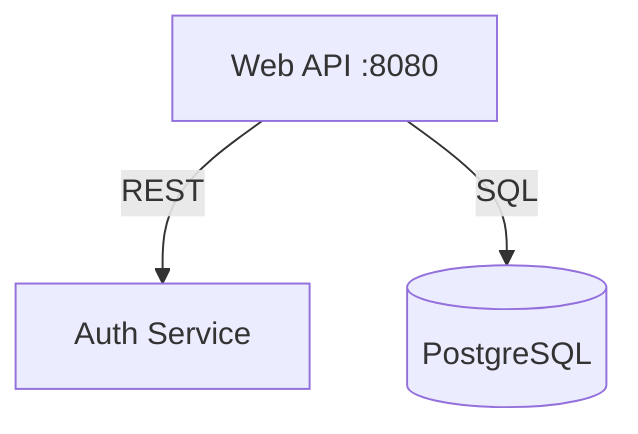

# Agent Handoff Documentation Plugin

A Claude Code plugin that automatically generates comprehensive handoff documentation optimized for AI agent takeover. Zero configuration. Fully autonomous. Machine-readable first.

## Overview

When handing off code to AI agents, traditional documentation isn't enough. Agents need:

- **Machine-readable requirements** (not marketing fluff)
- **Explicit architecture decisions** (to prevent "helpful" refactoring)
- **Strict terminology mappings** (to prevent hallucinated conversions)
- **Complete operational context** (to build, test, deploy autonomously)

This plugin analyzes your project and generates a complete **Context Stack** with 8 specialized documents.

## Features

- ✅ **Zero Configuration** - Works out of the box, no setup required
- ✅ **Fully Autonomous** - No user questions during generation
- ✅ **Adaptive Output** - Generates appropriate docs based on project type
- ✅ **Machine-Readable** - Optimized for AI agent consumption
- ✅ **Language Agnostic** - Supports Go, Python, TypeScript, Rust, Java, and more
- ✅ **Git-Friendly** - All outputs are version-controllable text files

## Installation

### From Marketplace

```bash
# Add marketplace
/plugin marketplace add yarlson/claude-plugins

# Install plugin
/plugin install agent-handoff@yarlson-claude-plugins
```

### From Local Directory

```bash
# Copy to Claude Code plugins directory
cp -r agent-handoff ~/.claude/plugins/

# Or create symlink for development
ln -s /path/to/agent-handoff ~/.claude/plugins/agent-handoff
```

### Verify Installation

```bash
claude --debug
# Look for "Loading plugin: agent-handoff"
```

## Usage

### Generate Documentation

Simply run:

```bash
/generate-handoff
```

That's it! The plugin will:

1. Discover and analyze your project (design docs, git history, codebase)
2. Detect project type and language
3. Generate the complete Context Stack (8 documents)
4. Output to `docs/handoff/`

### What Gets Generated

```
docs/handoff/
├── Handoff_Manifest.yaml                    # Master index (entry point for agents)
├── strategic-context/
│   ├── PRD_Machine_Readable.md              # Product requirements with Gherkin flows
│   ├── Architecture_Decision_Records.md     # Why things are the way they are
│   └── Domain_Dictionary.json               # Terminology mappings
├── operational-context/
│   ├── System_Context_Map.mermaid           # Service boundaries (if distributed)
│   ├── Agent_Runbook.md                     # Build, test, deploy instructions
│   └── Codebase_Walkthrough_Annotated.md    # Directory guide with intent
├── guardrails/
│   └── Test_Strategy_Matrix.md              # When to write which tests
└── generation-report.md                     # What was generated and why
```

## How It Works

### Phase 1: Discovery

The plugin automatically:

- Finds design documents in `docs/**/*.md`
- Analyzes git history (last 30 days)
- Detects project type (library, web service, CLI tool, monorepo)
- Scans codebase structure

### Phase 2: Analysis

Extracts structured information:

- Architecture decisions from code and docs
- Domain terminology from types, schemas, APIs
- System boundaries from Docker Compose, imports
- Build commands from Makefile, package.json, CI config

### Phase 3: Generation

Produces 8 documents:

1. **Handoff_Manifest.yaml** - Master index with project metadata
2. **PRD_Machine_Readable.md** - Requirements with Gherkin flows, invariants
3. **Architecture_Decision_Records.md** - Design rationale and "do not refactor" zones
4. **Domain_Dictionary.json** - Maps terms across code/DB/API
5. **System_Context_Map.mermaid** - Visual service dependency graph
6. **Agent_Runbook.md** - Setup and verification commands
7. **Codebase_Walkthrough_Annotated.md** - Directory structure with rules
8. **Test_Strategy_Matrix.md** - Test types, coverage, quality gates

### Phase 4: Output

- Backs up existing `docs/handoff/` if present
- Writes all documents to disk
- Generates validation checklist
- Prints summary report

## Project Type Detection

The plugin automatically detects your project type:

| Type                | Indicators                                    | System Map? |
| ------------------- | --------------------------------------------- | ----------- |
| **Library/Package** | `setup.py`, `Cargo.toml`, no HTTP server      | No          |
| **Web Service/API** | `Dockerfile`, `routes/`, HTTP server code     | Yes         |
| **CLI Tool**        | Entry point with arg parsing, no HTTP         | No          |
| **Monorepo**        | Multiple `go.mod`/`package.json`, `services/` | Yes         |

If detection is ambiguous, defaults to "generic" mode (generates all documents conservatively).

## Document Formats

### Machine-Readable Formats

**PRD uses Gherkin syntax:**

```gherkin
Given: User has valid credentials
When: User submits login form
Then: User receives JWT token
```

**Domain Dictionary uses JSON:**

```json
{
  "User": {
    "code_synonyms": ["subscriber", "account_holder"],
    "database_column": "usr_id",
    "api_field": "userId"
  }
}
```

**System Map uses Mermaid:**



## Example Output

After running `/generate-handoff`:

```
✅ Agent handoff documentation generated!

📁 Location: docs/handoff/

📄 Documents created:
  ✅ Handoff_Manifest.yaml (master index)
  ✅ Strategic Context (3 docs)
  ✅ Operational Context (3 docs)
  ✅ Guardrails (1 doc)
  ✅ Generation Report

🎯 Project: MyAPI (web-service, go)
🔍 Analyzed: 47 files, 156 commits, 3 design docs

📋 Next steps:
  1. Review docs/handoff/generation-report.md
  2. Validate docs/handoff/Handoff_Manifest.yaml
  3. Test commands in Agent_Runbook.md
  4. Commit with: git add docs/handoff && git commit
```

## When to Use

**Perfect for:**

- Preparing for AI agent handoff
- Onboarding new developers
- Documenting complex systems
- Creating living documentation
- Establishing team conventions

**Best with:**

- Well-structured codebases
- Projects with existing design docs
- Git repositories with commit history
- Standard project layouts

## Re-running

Safe to run multiple times:

```bash
/generate-handoff
```

The plugin will:

- Automatically backup existing `docs/handoff/` to `docs/handoff.backup.TIMESTAMP/`
- Generate fresh documentation
- Incorporate latest changes from git and code

## Validation Checklist

After generation, review:

### Strategic Context

- [ ] PRD flows match actual user journeys
- [ ] Invariants are complete and accurate
- [ ] Negative constraints capture all "don't touch" areas
- [ ] ADRs explain key architectural decisions

### Operational Context

- [ ] System map shows all dependencies (if applicable)
- [ ] Runbook commands work on fresh environment
- [ ] Codebase walkthrough explains major directories

### Guardrails

- [ ] Test strategy matches current practice
- [ ] Coverage requirements are enforced
- [ ] Quality gates are accurate

### Domain Dictionary

- [ ] All major entities are mapped
- [ ] Code/DB/API field mappings are correct

## Troubleshooting

### Plugin Not Loading

```bash
# Check plugin directory structure
ls -la ~/.claude/plugins/agent-handoff/

# Should show:
# .claude-plugin/plugin.json
# commands/generate-handoff.md
# skills/agent-handoff/SKILL.md
```

### No Design Docs Found

The plugin will still work! It generates documentation from:

- README.md
- Code analysis
- Git commit history
- Inferred patterns

A warning will appear in `generation-report.md`.

### Project Type Detection Failed

The plugin defaults to "generic" mode and generates all documents conservatively. Check `generation-report.md` for detection confidence.

### Commands in Runbook Don't Work

The plugin extracts commands from Makefile, package.json, and CI configs. If incorrect:

1. Check `generation-report.md` for sources used
2. Manually edit `Agent_Runbook.md`
3. Consider adding a Makefile or documenting commands

### Existing docs/handoff/ Directory

The plugin automatically backs up existing documentation to:

```
docs/handoff.backup.YYYYMMDD-HHMMSS/
```

## Advanced Usage

### For Monorepos

The plugin detects monorepos and generates:

- System Context Map with all services
- Per-service runbook instructions
- Cross-service dependency documentation

### For Projects Without Design Docs

The plugin generates documentation from:

- README.md feature descriptions
- Git commit messages
- Code structure and patterns
- Test descriptions

Less comprehensive but still useful for handoff.

### Customizing Generated Docs

After generation, you can manually edit any document in `docs/handoff/`. Re-running `/generate-handoff` will backup your edits before regenerating.

## Integration with AI Agents

### Handoff Protocol

AI agents should:

1. **Start with manifest:** Read `docs/handoff/Handoff_Manifest.yaml`
2. **Load strategic context:** Understand requirements and constraints
3. **Study operational context:** Learn how to build and run
4. **Follow guardrails:** Respect test strategy and quality gates

### Using the Context Stack

**For feature development:**

- Check PRD for existing user flows
- Review ADRs before major changes
- Use Domain Dictionary for consistent naming
- Follow Test Strategy Matrix

**For debugging:**

- Check Codebase Walkthrough for module purposes
- Consult ADRs for "do not refactor" zones
- Use Agent Runbook for verification commands

**For refactoring:**

- Read ADRs carefully (especially "Do Not Refactor" sections)
- Maintain invariants from PRD
- Follow conventions from Codebase Walkthrough

## Plugin Development

### Project Structure

```
agent-handoff/
├── .claude-plugin/
│   └── plugin.json              # Plugin metadata
├── commands/
│   └── generate-handoff.md      # Slash command
├── skills/
│   └── agent-handoff/
│       └── SKILL.md             # Core generation logic
└── README.md                    # This file
```

### Contributing

To contribute:

1. Fork the repository
2. Create a feature branch
3. Make your changes
4. Test with sample projects
5. Submit a pull request

### Testing

Test the plugin with different project types:

```bash
# Go web service
cd ~/projects/go-web-service
/generate-handoff

# Python CLI tool
cd ~/projects/python-cli
/generate-handoff

# TypeScript library
cd ~/projects/ts-library
/generate-handoff

# Verify output
cat docs/handoff/generation-report.md
```

## FAQ

### Q: Do I need existing design documentation?

**A:** No! The plugin works without design docs. It generates documentation from code, git history, and README. Having design docs improves quality though.

### Q: How long does generation take?

**A:** Typically 1-3 minutes for most projects, depending on size and complexity.

### Q: Can I run this multiple times?

**A:** Yes! It automatically backs up existing documentation before regenerating.

### Q: What if project type detection is wrong?

**A:** Check `generation-report.md` for detection confidence. If wrong, manually edit `Handoff_Manifest.yaml` or file an issue with your project structure.

### Q: Do I need to commit the generated docs?

**A:** Yes! The documentation is version-controllable and should be committed to git like any other documentation.

### Q: Can I customize the templates?

**A:** Not yet (v1.0.0). Custom templates support planned for v1.1.

### Q: Does this work with monorepos?

**A:** Yes! The plugin detects monorepos and generates appropriate documentation with cross-service dependencies.

### Q: What languages are supported?

**A:** All! The plugin is language-agnostic. It's been tested with Go, Python, TypeScript, Rust, and Java.

## Limitations

**Does not:**

- Modify your code
- Require configuration files
- Send data anywhere (runs locally)
- Support real-time updates (one-time generation)
- Generate custom document types (fixed 8 documents)

**Does:**

- Generate comprehensive documentation
- Work with any language/framework
- Backup existing documentation
- Detect project type automatically
- Provide validation checklists

## Version History

### 1.0.0 (2025-12-08)

**Initial release:**

- Zero-config autonomous generation
- Adaptive output based on project type
- 8-document Context Stack
- Support for Go, Python, TypeScript, Rust, Java
- Git-friendly output
- Automatic backup of existing docs

## License

MIT

## Author

Yaroslav K

## Support

For issues and questions:

- Check the troubleshooting section above
- Review `docs/handoff/generation-report.md` after generation
- Open an issue on GitHub

## Related

- [Claude Code Documentation](https://docs.anthropic.com/claude-code)
- [Plugin System](https://docs.anthropic.com/claude-code/plugins)
- [Autonomous Development Flow Plugin](../autonomous-dev-flow/README.md)

---

Built with ❤️ for AI agents who deserve good documentation.
