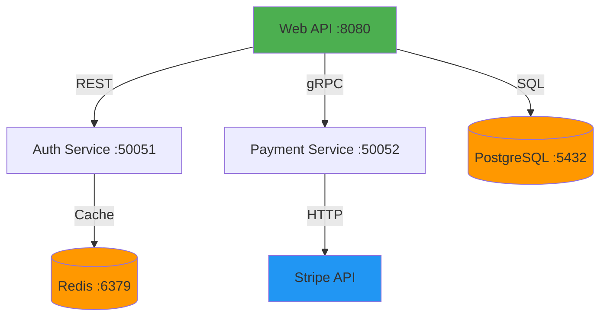

# Agent Handoff Documentation Generator

## Overview

Autonomously generate comprehensive handoff documentation optimized for AI agent takeover. Analyzes your project and produces a complete Context Stack in `docs/handoff/`.

**Core principle:** Zero configuration. Fully autonomous. Machine-readable first.

**Output:** 8-document Context Stack in `docs/handoff/` with master manifest.

## The Process

Execute these 4 phases sequentially:

### Phase 1: Discovery

Gather project information automatically:

#### 1.1 Find Design Documents

Use Glob to discover existing documentation:

```
docs/**/*.md
README.md
ARCHITECTURE.md
*/README.md
```

Look for keywords: design, architecture, ADR, requirements, specification, RFC

#### 1.2 Analyze Git History

```bash
git log --since="30 days ago" --pretty=format:"%h %s" --no-merges
```

Extract:

- Feature additions (feat:, add:, implement:)
- Major changes (refactor:, breaking:)
- Bug fixes (fix:, bug:)
- Architecture decisions from commit messages

#### 1.3 Detect Project Type

**File markers to check:**

```bash
# Libraries/Packages
ls setup.py pyproject.toml Cargo.toml package.json

# Web Services
ls Dockerfile docker-compose.yml
find . -name "routes*" -o -name "api*" -o -name "handlers*"

# CLI Tools
grep -r "cobra" "click" "commander" --include="*.go" --include="*.py" --include="*.ts"

# Monorepos
find . -name "go.mod" -o -name "package.json" | wc -l
ls services/ packages/ apps/
```

**Structure patterns:**

- Go: `cmd/`, `internal/`, `pkg/`
- Library: `src/`, `lib/`, `tests/`
- Service: `api/`, `handlers/`, `routes/`

**Classification logic:**

```
IF (has Dockerfile + routes/) → web-service
ELSE IF (has setup.py + no HTTP) → library
ELSE IF (has main with arg parsing + no HTTP) → cli-tool
ELSE IF (multiple go.mod/package.json) → monorepo
ELSE → generic
```

**Detection output format:**

```yaml
project_type: "web-service" # library | cli-tool | monorepo | generic
language: "go" # go | python | typescript | rust | etc
framework: "gin" # if detected (optional)
confidence: "high" # high | medium | low
```

#### 1.4 Scan Codebase Structure

```bash
# Map directories (exclude hidden, node_modules, vendor)
find . -type d -not -path '*/\.*' -not -path '*/node_modules/*' -not -path '*/vendor/*'

# Identify entry points
find . -name "main.go" -o -name "main.py" -o -name "index.ts" -o -name "app.py"

# Count file types
find . -name "*.go" -o -name "*.py" -o -name "*.ts" -o -name "*.rs" | sort | uniq -c
```

### Phase 2: Analysis

Extract structured information from discovered sources:

#### 2.1 Extract Architecture Decisions

**Sources:**

- Existing ADR files in `docs/adr/` or `docs/architecture/`
- Code comments containing: "IMPORTANT", "DO NOT", "WHY", "HACK"
- Git blame for major refactorings
- README sections about architecture

**What to extract:**

- Why this technology choice?
- Why this structure/pattern?
- What must NOT be changed and why?
- Known trade-offs and their rationale

#### 2.2 Build Domain Dictionary

**Extract terminology from:**

1. **Type Definitions**

   ```bash
   # Go
   grep -r "type.*struct" --include="*.go"

   # Python
   grep -r "class " --include="*.py"

   # TypeScript
   grep -r "interface " --include="*.ts"
   ```

2. **Database Schema**

   ```bash
   # Find migrations
   find . -path "*/migrations/*" -o -path "*/schema/*"

   # Look for SQL files
   find . -name "*.sql"
   ```

3. **API Schemas**

   ```bash
   # OpenAPI/Swagger
   find . -name "openapi.yaml" -o -name "swagger.json"

   # GraphQL
   find . -name "schema.graphql" -o -name "*.gql"
   ```

**Build mapping:**

```json
{
  "Term": {
    "code_synonyms": ["list", "of", "variations"],
    "database_column": "db_column_name",
    "type": "data_type",
    "api_field": "apiFieldName"
  }
}
```

#### 2.3 Map System Boundaries

**Only for distributed systems (web-service, monorepo):**

1. **Parse Docker Compose**

   ```bash
   # Find docker-compose files
   find . -name "docker-compose*.yml"

   # Extract services, ports, dependencies
   ```

2. **Find External API Calls**

   ```bash
   # HTTP client usage
   grep -r "http.Client" "requests.get" "axios" "fetch"

   # Extract hostnames from code
   grep -r "https://" --include="*.go" --include="*.py" --include="*.ts"
   ```

3. **Identify Databases**

   ```bash
   # Database drivers
   grep -r "postgres" "mysql" "mongodb" "redis"

   # Connection strings (sanitized)
   grep -r "DATABASE_URL" "DB_HOST"
   ```

4. **Generate Mermaid Graph**
   ```mermaid
   graph TD
       A[Service Name :port] -->|protocol| B[Dependency]
       A -->|SQL| C[(Database)]
   ```

#### 2.4 Discover Build Commands

**Check these sources in order:**

1. **Makefile**

   ```bash
   cat Makefile | grep "^[a-z].*:"
   ```

2. **package.json scripts**

   ```bash
   cat package.json | jq '.scripts'
   ```

3. **CI/CD configs**

   ```bash
   cat .github/workflows/*.yml
   cat .gitlab-ci.yml
   ```

4. **Language defaults**
   ```
   Go:       go build ./...
   Python:   pip install -e .
   Rust:     cargo build
   Node:     npm install
   ```

**Extract:**

- Build/compile command
- Lint command
- Test command
- Integration test command
- Deploy/run command

### Phase 3: Generation

Generate all 8 documents using extracted data:

#### 3.1 Generate Handoff_Manifest.yaml

**Always generated first as master index.**

```yaml
project_name: "<extracted from git remote or dir name>"
generated_at: "<ISO 8601 timestamp>"
generator_version: "1.0.0"
project_type: "<from detection>"
language: "<from detection>"
framework: "<from detection or null>"
confidence: "<from detection>"

critical_context:
  - "./strategic-context/PRD_Machine_Readable.md"
  - "./strategic-context/Architecture_Decision_Records.md"
  - "./strategic-context/Domain_Dictionary.json"

execution_context:
  - "./operational-context/Agent_Runbook.md"
  <% if has_system_map %>
  - "./operational-context/System_Context_Map.mermaid"
  <% end %>
  - "./operational-context/Codebase_Walkthrough_Annotated.md"

guardrails:
  - "./guardrails/Test_Strategy_Matrix.md"

constraints:
  <% list extracted constraints from ADRs, comments %>

quality_gates:
  build_command: "<from discovery>"
  lint_command: "<from discovery or 'not configured'>"
  test_command: "<from discovery>"
  coverage_threshold: <from config or 80>
```

#### 3.2 Generate PRD_Machine_Readable.md

**Sources:**

- Existing design docs
- README.md features section
- Git commits (features added)
- Code analysis (exported APIs, endpoints, commands)

**Format:**

```markdown
# Product Requirements Document (Machine-Readable)

**Project:** <name>
**Type:** <project_type>
**Version:** <from package file or git tag>

## Purpose

<extract from README or design docs>

## Core User Flows

<Generate Gherkin-style scenarios from:>
- README examples
- Test descriptions
- Code comments
- API endpoint handlers

### Flow: <extracted flow name>

**Given:** <precondition>
**When:** <action>
**Then:** <expected result>

## Invariants

<Extract from:>
- Code comments with "MUST", "ALWAYS", "NEVER"
- Validation logic
- Test assertions
- Security checks

Examples:

- User passwords are never stored in plaintext
- All API endpoints require authentication except /health
- Database transactions use isolation level READ COMMITTED

## Negative Constraints

<Extract from:>
- Comments with "DO NOT"
- ADRs with "rejected alternatives"
- Code marked with "HACK" or "WORKAROUND"

Examples:

- Do not introduce new npm dependencies without approval
- Do not refactor the legacy auth system (external dependencies)
- Do not change database schema without migration

## Success Criteria

<Extract from:>
- Test coverage requirements
- Performance benchmarks
- README goals section

Examples:

- All endpoints respond in <200ms p95
- Test coverage >80%
- Zero critical security vulnerabilities
```

#### 3.3 Generate Architecture_Decision_Records.md

**Format:**

```markdown
# Architecture Decision Records

<For each discovered ADR or major decision:>

## ADR-<number>: <Title>

**Status:** <accepted | rejected | superseded>
**Date:** <from git or "unknown">

### Context

<Why was this decision needed?>

### Decision

<What was decided?>

### Consequences

**Positive:**

- <benefit 1>
- <benefit 2>

**Negative:**

- <trade-off 1>
- <trade-off 2>

### Do Not Refactor

<Extract code blocks that should NOT be changed:>

**File:** `path/to/file.go:line`
**Reason:** <why this ugly code exists>

Example:

- `internal/auth/session.go:45-67` - UUID v4 required for legacy Java service compatibility
```

#### 3.4 Generate Domain_Dictionary.json

**Format:**

```json
{
  "<Term>": {
    "code_synonyms": ["<variant1>", "<variant2>"],
    "database_column": "<column_name>",
    "type": "<data_type>",
    "api_field": "<apiFieldName>",
    "description": "<optional brief description>"
  }
}
```

**Example:**

```json
{
  "User": {
    "code_synonyms": ["subscriber", "account_holder", "member"],
    "database_column": "usr_id",
    "type": "uuid",
    "api_field": "userId",
    "description": "Registered user account"
  },
  "Session": {
    "code_synonyms": ["auth_session", "login_session"],
    "database_column": "session_token",
    "type": "string",
    "api_field": "sessionId",
    "description": "Active authentication session"
  }
}
```

#### 3.5 Generate System_Context_Map.mermaid

**Only for: web-service, monorepo**
**Skip for: library, cli-tool, generic**

```mermaid
graph TD
    <% for each service %>
    <ID>[<Name> :<port>]
    <% end %>

    <% for each dependency %>
    <FROM> -->|<protocol>| <TO>
    <% end %>

    <% for each database %>
    <ID>[(<Database Type> :<port>)]
    <% end %>

    <% for each external API %>
    <ID>[<External API>]
    <% end %>

    style <main_service> fill:#4CAF50
    style <databases> fill:#FF9800
    style <external> fill:#2196F3
```

**Example:**



#### 3.6 Generate Agent_Runbook.md

**Format:**

````markdown
# Agent Runbook

## Environment Setup

### Prerequisites

<Extract from README, Dockerfile, or detect:>

- <Language> <version>
- <Database> <version>
- <Other dependencies>

### Quick Start

```bash
# Clone repository
git clone <repo_url>
cd <project_name>

# Install dependencies
<from discovery: make setup, npm install, pip install, etc>

# Configure environment
<if .env.example exists>
cp .env.example .env.local
# Edit .env.local with your settings

# Run locally
<from discovery: make dev, npm start, go run, etc>

# Verify installation
<from discovery: make verify, npm test, etc>
```
````

## Verification Commands

**Build/Compile:**

```bash
<from discovery or language default>
```

**Lint:**

```bash
<from discovery or "not configured">
```

**Test:**

```bash
<from discovery>
```

**Integration Tests:**

```bash
<from discovery or "not configured">
```

**Coverage:**

```bash
<from discovery or language-specific command>
```

## Development Workflow

<Extract from CONTRIBUTING.md or infer:>

1. Create feature branch: `git checkout -b feature/name`
2. Make changes
3. Run tests: `<test command>`
4. Commit: `git commit -m "feat: description"`
5. Push: `git push origin feature/name`

## Secret Management

<If .env.example exists:>
Mock credentials available in `.env.example` for testing.
Never commit real secrets to version control.

<If no .env.example:>
Check documentation for required environment variables.

## Common Issues

<Extract from:>
- README troubleshooting section
- GitHub issues (if accessible)
- Code comments with "NOTE" or "WARNING"

## Service Dependencies

<If distributed system:>
Required services:
<list from docker-compose or System Context Map>

Start all services:

```bash
docker-compose up -d
```

````

#### 3.7 Generate Codebase_Walkthrough_Annotated.md

**Format:**

```markdown
# Codebase Walkthrough

## Project Structure

````

<tree output of main directories>
```

## Directory Guide

<For each major directory:>

### `/<directory>/`

**Purpose:** <infer from name and contents>

**Rules:**

- <infer from code patterns>
- <extract from comments>

**Key Files:**

- `<file>` - <purpose>
- `<file>` - <purpose>

**Example patterns:**

### `/cmd/`

**Purpose:** Main application entry points
**Rules:**

- One main.go per service
- No business logic here (only wiring)
- Keep it thin (<100 lines)

### `/internal/`

**Purpose:** Private application code
**Rules:**

- Not importable by external projects
- Contains business logic and domain models

### `/internal/core/`

**Purpose:** Business logic and domain models
**Rules:**

- Pure functions only
- No database calls directly
- No HTTP handling
- Testable in isolation

### `/internal/adapters/`

**Purpose:** External integrations (DB, APIs, message queues)
**Rules:**

- Retry logic mandatory
- Graceful degradation
- Circuit breakers for external APIs

### `/pkg/`

**Purpose:** Public reusable utilities
**Rules:**

- Framework-agnostic
- Thoroughly tested
- Well-documented

### `/api/`

**Purpose:** API definitions (OpenAPI, protobuf)
**Rules:**

- Version all breaking changes
- Keep backwards compatible

### `/tests/`

**Purpose:** Integration and E2E tests
**Rules:**

- Test real scenarios
- Use test doubles for external services

## Entry Points

**Main application:** `<path>`
**Test suite:** `<path>`
**Documentation:** `<path>`

## Important Files

<List critical files:>
- `<file>` - <why important>

## Naming Conventions

<Extract from code patterns:>
- Files: <pattern>
- Functions: <pattern>
- Variables: <pattern>
- Tests: <pattern>
```

#### 3.8 Generate Test_Strategy_Matrix.md

**Format:**

````markdown
# Test Strategy Matrix

## Test Types

| Test Type   | When Required         | Coverage Target | Location    | Example  |
| ----------- | --------------------- | --------------- | ----------- | -------- |
| Unit        | All new functions     | 90% branch      | `<pattern>` | `<file>` |
| Integration | New endpoints/modules | All happy paths | `<pattern>` | `<file>` |
| E2E         | Critical user flows   | Core journeys   | `<pattern>` | `<file>` |
| Performance | <if applicable>       | <target>        | `<pattern>` | `<file>` |

## Coverage Requirements

<Extract from:>
- CI config
- Test framework config
- Existing test patterns

**New features:** <X>% branch coverage minimum
**Bug fixes:** Must add regression test
**Refactoring:** No coverage decrease allowed

## Test Patterns

<Extract from existing tests:>

### Unit Tests

```<language>
<example from codebase>
```
````

### Integration Tests

```<language>
<example from codebase>
```

### Mocking Strategy

<Extract from code:>
- Mock external APIs: <how>
- Mock database: <how>
- Mock time: <how>

## Quality Gates

Before merging/deploying:

- ✅ All tests pass
- ✅ Coverage >= <threshold>%
- ✅ No flaky tests
- ✅ Integration tests pass
- ✅ No test warnings

## Running Tests

**All tests:**

```bash
<command>
```

**Unit only:**

```bash
<command>
```

**Integration only:**

```bash
<command>
```

**With coverage:**

```bash
<command>
```

**Watch mode:**

```bash
<command or "not supported">
```

## CI/CD Integration

<Extract from .github/workflows or similar:>

Tests run on:

- Every push
- Every PR
- Before deploy

Pipeline: <describe stages>

````

#### 3.9 Generate generation-report.md

**Format:**

```markdown
# Handoff Documentation Generation Report

**Generated:** <timestamp>
**Generator Version:** 1.0.0
**Project:** <name>
**Project Type:** <type> (<language>)
**Detection Confidence:** <confidence>

## Documents Created

✅ Handoff_Manifest.yaml
✅ PRD_Machine_Readable.md (sources: <list>)
✅ Architecture_Decision_Records.md (found <N> ADRs)
✅ Domain_Dictionary.json (mapped <N> terms)
<% if has_system_map %>
✅ System_Context_Map.mermaid (<N> services, <N> databases, <N> external APIs)
<% else %>
⏭️  System_Context_Map.mermaid (skipped - not a distributed system)
<% end %>
✅ Agent_Runbook.md (found <N> commands)
✅ Codebase_Walkthrough_Annotated.md (analyzed <N> directories)
✅ Test_Strategy_Matrix.md (found <N> test types)

## Sources Analyzed

**Design Documents:** <N> files
<list paths>

**Git History:** <N> commits analyzed

**Code Files:** <N> files scanned

**Project Detection:**
- Type: <type>
- Language: <language>
- Framework: <framework or "none detected">
- Confidence: <confidence>

## Warnings

<if any issues occurred:>
⚠️  <warning message>

<if no issues:>
No warnings.

## Next Steps

1. **Review** `docs/handoff/Handoff_Manifest.yaml` for accuracy
2. **Validate** constraints in manifest match your requirements
3. **Check** `Domain_Dictionary.json` for terminology accuracy
4. **Test** commands in `Agent_Runbook.md` on fresh environment
5. **Commit** documentation to version control:
   ```bash
   git add docs/handoff
   git commit -m "Add agent handoff documentation"
````

## Validation Checklist

### Strategic Context

- [ ] PRD flows match actual user journeys
- [ ] Invariants are complete and accurate
- [ ] Negative constraints capture all "don't touch" areas
- [ ] ADRs explain key architectural decisions

### Operational Context

<% if has_system_map %>

- [ ] System map shows all dependencies
      <% end %>
- [ ] Runbook commands work on fresh environment
- [ ] Codebase walkthrough explains all major directories
- [ ] Entry points are correctly identified

### Guardrails

- [ ] Test strategy matches current practice
- [ ] Coverage requirements are enforced in CI
- [ ] Quality gates are accurate

### Domain Dictionary

- [ ] All major entities are mapped
- [ ] Code/DB/API field mappings are correct
- [ ] No missing synonyms

## Feedback

Found an issue? Suggestions for improvement?
Regenerate with: `/generate-handoff`

````

### Phase 4: Output

Write all generated documents to disk and report results.

#### 4.1 Check for Existing docs/handoff/

```bash
if [ -d "docs/handoff" ]; then
    # Backup existing
    mv docs/handoff docs/handoff.backup.$(date +%Y%m%d-%H%M%S)
    echo "Backed up existing handoff docs"
fi
````

#### 4.2 Create Directory Structure

```bash
mkdir -p docs/handoff/strategic-context
mkdir -p docs/handoff/operational-context
mkdir -p docs/handoff/guardrails
```

#### 4.3 Write All Documents

Use Write tool for each document:

1. `docs/handoff/Handoff_Manifest.yaml`
2. `docs/handoff/strategic-context/PRD_Machine_Readable.md`
3. `docs/handoff/strategic-context/Architecture_Decision_Records.md`
4. `docs/handoff/strategic-context/Domain_Dictionary.json`
5. `docs/handoff/operational-context/System_Context_Map.mermaid` (if applicable)
6. `docs/handoff/operational-context/Agent_Runbook.md`
7. `docs/handoff/operational-context/Codebase_Walkthrough_Annotated.md`
8. `docs/handoff/guardrails/Test_Strategy_Matrix.md`
9. `docs/handoff/generation-report.md`

#### 4.4 Present Summary

Print concise summary to user:

```
✅ Agent handoff documentation generated!

📁 Location: docs/handoff/

📄 Documents created:
  ✅ Handoff_Manifest.yaml (master index)
  ✅ Strategic Context (3 docs)
  ✅ Operational Context (3 docs)
  ✅ Guardrails (1 doc)
  ✅ Generation Report

🎯 Project: <name> (<type>, <language>)
🔍 Analyzed: <N> files, <N> commits, <N> design docs

📋 Next steps:
  1. Review docs/handoff/generation-report.md
  2. Validate docs/handoff/Handoff_Manifest.yaml
  3. Test commands in Agent_Runbook.md
  4. Commit with: git add docs/handoff && git commit
```

## Important Guidelines

### Autonomous Execution

- **Never ask user questions** - make informed decisions
- Use sensible defaults when information is missing
- Document assumptions in generation-report.md
- Warn about low-confidence detections

### Machine-Readable First

- Use strict formats (YAML, JSON, Gherkin)
- Avoid ambiguous language
- Use assertions over descriptions
- Prefer lists and tables over prose

### Completeness

- Generate all applicable documents
- Don't skip sections due to missing data
- Use "unknown" or "not detected" when appropriate
- Mark low-confidence extractions

### Error Handling

- If project type detection fails → use "generic" mode
- If no design docs found → generate from code/README
- If no build commands found → use language defaults
- If existing docs/handoff/ → backup automatically

### Quality

- Verify all file paths are correct
- Ensure manifest links point to real files
- Validate YAML/JSON syntax
- Test that Mermaid diagram is valid

## Success Criteria

**Must generate:**

- ✅ All 8 documents (or 7 if System Map not applicable)
- ✅ Valid Handoff_Manifest.yaml with correct links
- ✅ generation-report.md with validation checklist

**Must complete:**

- ✅ In < 3 minutes for typical project
- ✅ Without user interaction
- ✅ With clear summary output

**Must handle:**

- ✅ Projects with no design docs
- ✅ Projects with existing docs/handoff/
- ✅ All 4 project types
- ✅ Multiple languages

## Notes

- This skill runs in main conversation (not as subagent)
- Uses standard Claude Code tools (Glob, Grep, Read, Write, Bash)
- Output is git-friendly (all text files)
- Can be re-run safely (backs up existing docs)
- Optimized for AI agent consumption, not human reading
